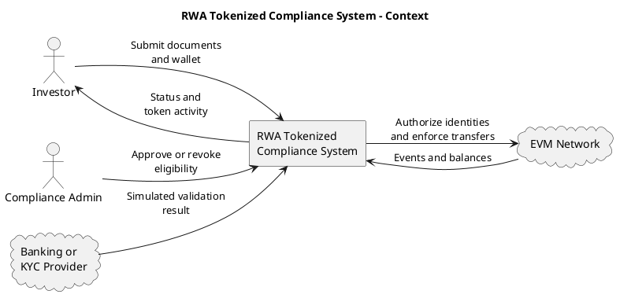
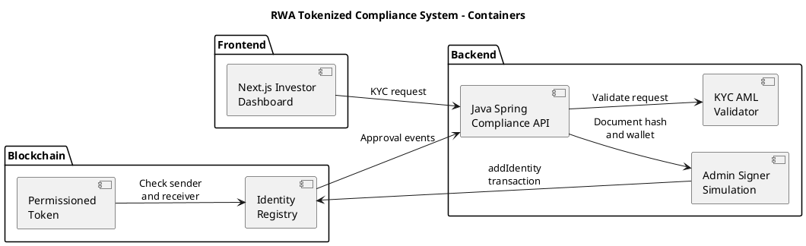
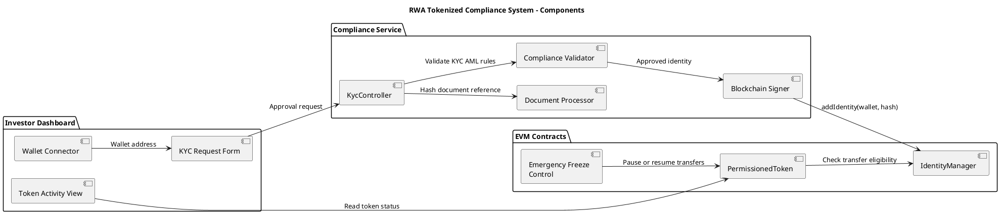
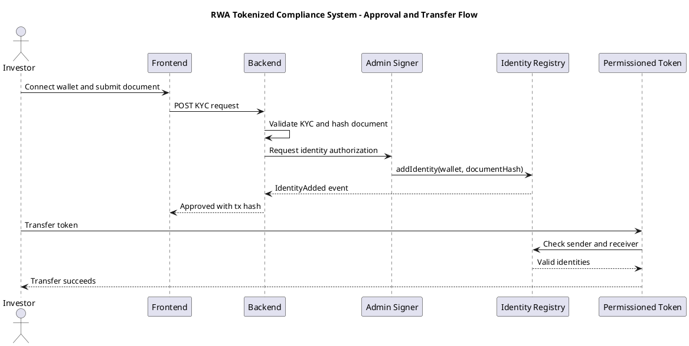

# Diagrams

GitHub repository: <https://github.com/andreilopes11/rwa-tokenized-compliance-system.git>

## Context Diagram

## Container Diagram

## Component Diagram

## Approval and Transfer Flow

